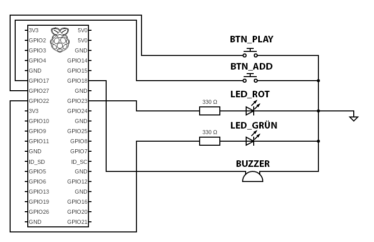

# Raspberry Pi 4 – Mini-Slotmaschine mit 2 physischen Tastern (Steckbrett) und Weboberfläche via Flask

## Projektbeschreibung

Dieses Projekt zeigt, wie man mit einem Raspberry Pi 4, zwei physischen Tastern, zwei LEDs und etwas Python-Code eine einfache Slotmaschine bauen kann. Die Kombination aus Hardware und Webtechnologie (Flask) macht es zu einem idealen Lernprojekt für Einsteiger in die Raspberry-Pi-Programmierung und Physical Computing.

## Funktionen

- **Taster 1 (BTN_PLAY, GPIO17 / Pin 11):** +1 Guthaben je Tastendruck
- **Taster 2 (BTN_ADD, GPIO27 / Pin 13):** Startet das Spiel
  - kostet 5 Guthaben
  - generiert drei Zufallszahlen (1–9)
  - sind alle drei identisch → Restguthaben wird verdoppelt
- **LED-Anzeige:**
  - beide LEDs blinken 2 Sekunden beim Start einer Runde
  - danach: **grün** leuchtet bei Gewinn, **rot** leuchtet bei Verlust
- **Weboberfläche:**
  - zeigt aktuelles Guthaben & letzten Spin an
  - Slot-Animation im Browser während der Drehphase
  - Live-Updates durch Polling
- **Optional:** Web-Buttons zum Testen (auch ohne Taster nutzbar)
- **Persistenz:** Guthaben & letzter Status werden in JSON-Datei gespeichert

---

## GPIO-Belegung (BCM)

- **BTN_PLAY** = GPIO17 (Board-Pin 11)
- **BTN_ADD** = GPIO27 (Board-Pin 13)
- **LED_GRÜN** = GPIO22 (Board-Pin 15)
- **LED_ROT** = GPIO23 (Board-Pin 16)

---

## Konfiguration und Parameter (aus `app.py`)

Im oberen Bereich der `app.py` werden zentrale GPIO-Zuweisungen und Spielparameter definiert. Diese können bei Bedarf angepasst werden:

### GPIO-Zuweisungen (BCM-Nummerierung)

| Zweck             | GPIO | Pin am Raspberry Pi |
| ----------------- | ---- | ------------------- |
| Taster „Start“    | 17   | Pin 11              |
| Taster „+1“       | 27   | Pin 13              |
| Grüne LED         | 22   | Pin 15              |
| Rote LED          | 23   | Pin 16              |
| Buzzer (optional) | 18   | Pin 12              |

> Die GPIO-Nummern entsprechen der **BCM-Nummerierung** (nicht der physischen Pin-Reihenfolge).

### Spielparameter

| Variable          | Bedeutung                                   | Standardwert |
| ----------------- | ------------------------------------------- | ------------ |
| `COST_PER_PLAY`   | Kosten pro Spielrunde in Guthabeneinheiten  | 5            |
| `WIN_PROBABILITY` | Gewinnwahrscheinlichkeit (zwischen 0 und 1) | 0.2 (20 %)   |
| `BOUNCE_SECS`     | Entprellzeit für die Taster in Sekunden     | 0.1          |

Diese Parameter können angepasst werden, um das Spielverhalten zu ändern – z. B. durch Erhöhung der Kosten oder Verringerung der Gewinnchance.

---

## Verkabelung

- **Taster:**

  - eine Seite an **GND**
  - andere Seite an den jeweiligen GPIO-Pin (17 bzw. 27)
  - interne Pull-Ups aktiv → Signal ist HIGH, beim Drücken LOW

- **LEDs:**
  - **grüne LED:** GPIO22 → Widerstand (220–330 Ω) → Anode (langer Pin) → Kathode → GND
  - **rote LED:** GPIO23 → Widerstand (220–330 Ω) → Anode (langer Pin) → Kathode → GND

---

## Abhängigkeiten installieren (Raspberry Pi OS)

```bash
sudo apt update
sudo apt install -y python3-flask python3-gpiozero
```

---

## Starten

```bash
python3 app.py
```

Weboberfläche im Browser öffnen:

```
http://<IP-des-Pi>:5000
```

---

## Projektstruktur

```
slotmachine/
├── app.py              # Hauptprogramm (Flask + GPIO-Logik)
├── test.py             # Testskript (z.B. Unit Tests)
├── slot_state.json     # Speicherung von Guthaben & Spielstatus
├── static/
│   └── style.css       # CSS-Styles für die Weboberfläche
├── templates/
│   └── index.html      # HTML-Template (Jinja2)
├── assets/
│   └── circuit_2.png   # Schaltplan als Bild
└── README.md           # Diese Anleitung
```

---

## Schema



---

## Testskript: `test.py`

Mit dem mitgelieferten Skript `test.py` kannst du die LED an GPIO23 (Pin 16) unabhängig vom Hauptprogramm testen. Es lässt die LED im Sekundentakt blinken (1 Sekunde an, 1 Sekunde aus) und dient dazu, die Verkabelung sowie die Funktion der LED zu überprüfen.

### Starten:

```bash
python3 test.py
```

---

## Mögliche Probleme

- **Weboberfläche lädt nicht?** → Prüfe, ob der Flask-Server läuft und Port 5000 freigegeben ist.
- **Keine LED-Reaktion?** → GPIO-Verkabelung & Widerstände überprüfen, Wackelkontakt auf Breadboard testen.
- **Taster funktioniert nicht?** → GPIO-Pins richtig gesetzt?
